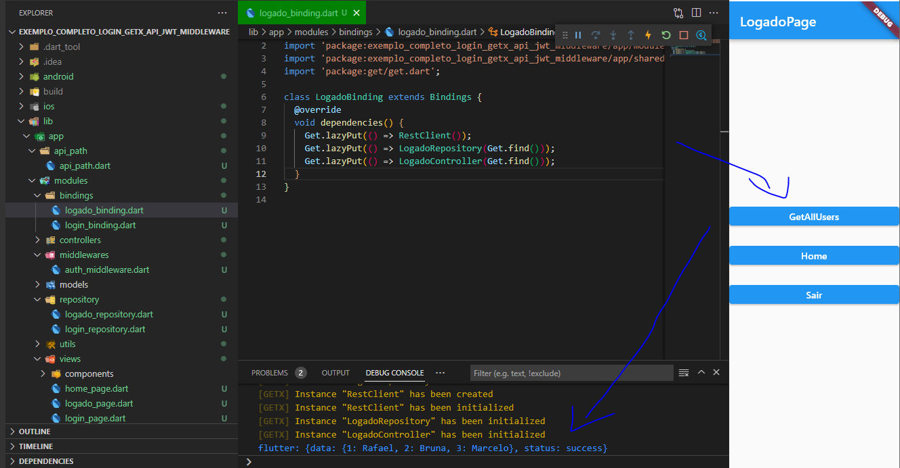

# flutter_login_completo_com_api_php
Exemplo completo de login com Flutter usando API e PHP no Back-end.

## Back-end PHP:

- API PHP ( Com verificação de header );
- Geração e retorno de JWT quando login correto e verificação quando enviado no header para futura requisição no banco de dados;

## Front-end Flutter:

- Requisição de API com GetConnect enviando header junto;
- Arquitetura;
- Baixo Acoplamento;
- Verificação token JWT;
- Armazenamento de token;
- Middleware para restrição de acesso;

## Pacotes:

- get: ^4.6.5
- get_storage: ^2.0.3

## Para Instalar o PHP
<a href="https://www.youtube.com/watch?v=HzIXZVctwI8&t=1s&ab_channel=TekZoom">https://www.youtube.com/watch?v=HzIXZVctwI8&t=1s&ab_channel=TekZoom</a>

--------

Obs: O layout ficou simples porque o foco foi para a estrutura, funcionalidade, requisiçõe API e restrição de acesso;

