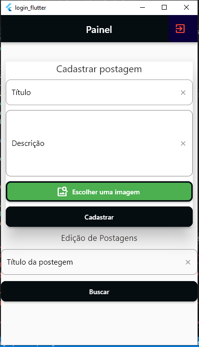
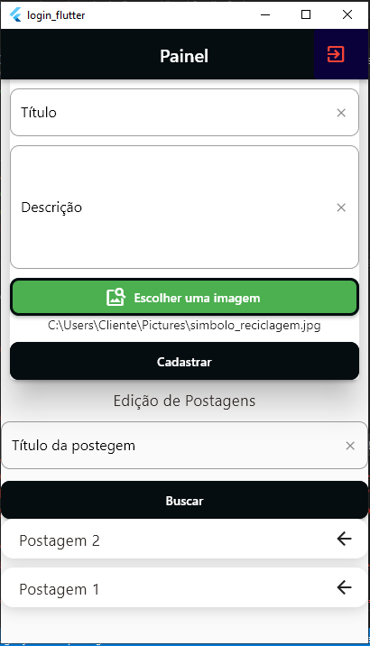
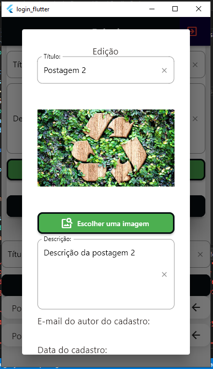
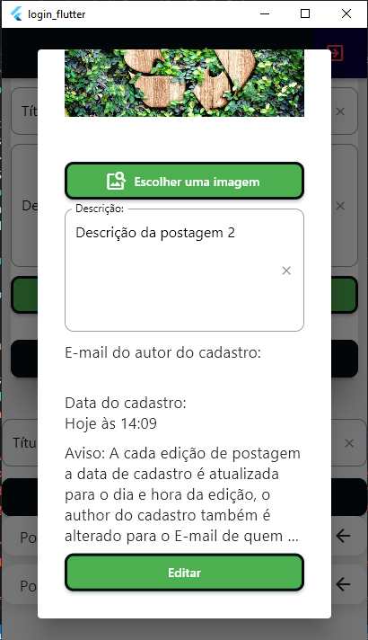
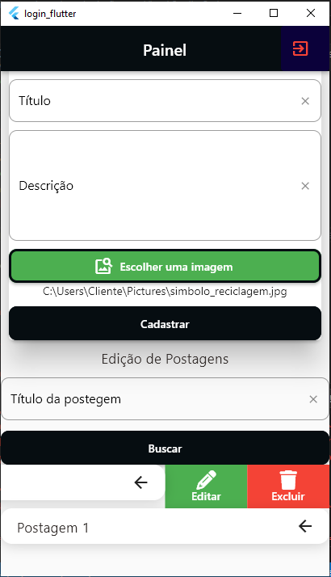
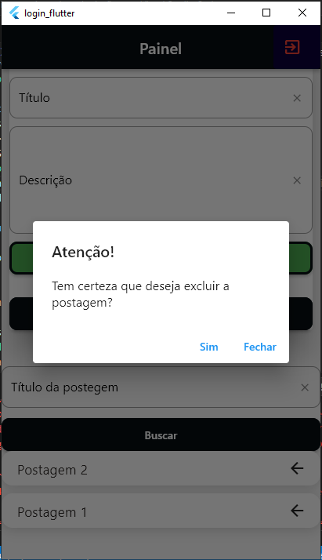

# Modelo de sistema de login e cadastro de usuários Flutter consumindo API PHP
Este modelo contém a base de login, cadastro de usuários e CRUD de postagens consumindo uma API PHP (com link para o repositório back-end PHP).

## Indice
- Tecnologias utilizadas;
- Requisitos e links que auxiliam;
- Como instalar;
- Imagens do modelo;
- Dicas de Extensões para VS Code;

### Tecnologias utilizadas
- Dart: 2.18, Flutter: 3.1;
- Pacotes: get: ^4.6.5, get_storage: ^2.0.3, mask_text_input_formatter: ^2.4.0, file_picker_cross: ^4.4.2, flutter_slidable: ^2.0.0, font_awesome_flutter: ^10.4.0, cached_network_image: ^3.2.1;
- Arquitetura MVC;
- Verificação e armazenamento de token JWT;
- Saparação de códigos em componentes, Baixo Acoplamento, Alta coesão; 
- Middleware para restrição de acesso;
- Requisições de API;

### Requisitos e links que auxiliam
- Flutter instalado, aqui tem um <a href="https://www.youtube.com/watch?v=FUWYvBJOlsI">vídeo</a> ensinando a instalar o Flutter ou você pode instalar o FVM (Gerenciador de versão do Flutter) usando esse <a href="https://www.youtube.com/watch?v=lQCf4At6Upc">vídeo</a>
- PHP instalado e sistema Back-End da API rodando, aqui neste <a href="https://github.com/Maycon-crz/modelo_de_sistema_php_com_api/blob/main/README.md">repositório</a> tem tudo o que é necessário para instalar o PHP e deixar o Back-End funcionando;

### Como instalar
- 1º) Certifique-se se de que o Dart, Flutter estão instalados entrando no prompt de comando e digitando: dart --version e flutter --version, verifique se o servidor php está funcionando;
- 2º) Copie o link do repositório no gitHub, va até a pasta que deseja clonar o projeto, apague o endereço da pasta e digite cmd, vai abrir o prompt de comando, com o caminho da pasta, em seguida digite: git clone (da um espaço) e cole o link do repositório;
- 3º) Abra a pasta (login_flutter) no VS Code em seguida abra o terminal e digite o comando: (flutter clean) deipois (flutter analyze) caso ainda ocorram erros verifique as versões do dart, flutter e dos pacotes.
- 4º) Para iniciar o sistema clique em Run and Debug ou digite: (flutter run -d);
- 5º) Caso queira rodar o sistema diretamente no windows é necessário fazer algumas configurações aqui está a <a href="https://docs.flutter.dev/platform-integration/desktop">documentação</a> que mostra como fazer;
- 6º) No terminal digite (flutter doctor -v) vai aparecer os requisitos que faltam, instale o Android Studio e Visual Studio clicando nos links mostrados no terminal (selecione também na hora de instalar o Visual Studio essas opções: desenvolvimento para Desktop e Mobile. OBS: vai ser necessário ter um bom espaço de armazento para conseguir instalar tudo o que é necessário).

### Imagens do modelo
| Imagem 1                                               | Imagem 2                                                     |
| ------------------------------------------------------ | ------------------------------------------------------------ |
|                       |                  |
--------
| Cadastro de postagem                                   | Edição de postagem                                           |
| ------------------------------------------------------ | ------------------------------------------------------------ |
|          |           |
--------
| Edição de postagem                                     | Edição de postagem                                           |
| ------------------------------------------------------ | ------------------------------------------------------------ |
|     |           |
--------
| Exclusão de postagem                                   | Exclusão de postagem                                         |
| ------------------------------------------------------ | ------------------------------------------------------------ |
|   |         |
--------

### Dicas de Extensões para VS Code
- <a href="https://marketplace.visualstudio.com/items?itemName=Dart-Code.dart-code">Dart</a>
- <a href="https://marketplace.visualstudio.com/items?itemName=Dart-Code.flutter">Flutter</a>
- <a href="https://marketplace.visualstudio.com/items?itemName=dotup.dart-data-class-generator">Dart Data Class Generator</a>
- <a href="https://marketplace.visualstudio.com/items?itemName=usernamehw.errorlens">Error Lens</a>
- <a href="https://marketplace.visualstudio.com/items?itemName=RodrigoRahman.flutter-dart-utils">Flutter & Dart Utilities</a>
- <a href="https://marketplace.visualstudio.com/items?itemName=aksharpatel47.vscode-flutter-helper">Flutter Helpers</a>
- <a href="https://marketplace.visualstudio.com/items?itemName=Flutterando.flutter-mobx">flutter_mobx</a>
- <a href="https://marketplace.visualstudio.com/items?itemName=FlutterBricksProductions.flutterbricks">FlutterBricks</a>
- <a href="https://marketplace.visualstudio.com/items?itemName=get-snippets.get-snippets">GetX Snippets</a>
- <a href="https://marketplace.visualstudio.com/items?itemName=funkyremi.vscode-google-translate">Vscode Google Translate</a>
- <a href="https://marketplace.visualstudio.com/items?itemName=Codeium.codeium">Codeium: AI Coding Autocomplete</a>

